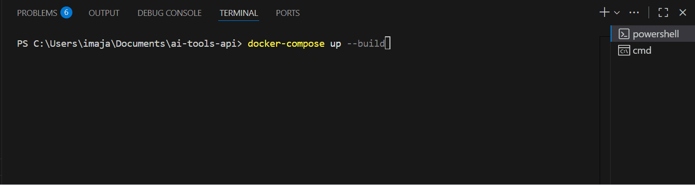
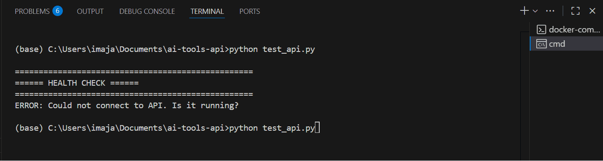

# AI Tools Management API

This is a complete, production-ready backend service for managing a catalog of AI tools, featuring powerful semantic search capabilities.

📦 ## Project Overview

This project provides a full-stack backend service with:

* ✅ **FastAPI**: Complete CRUD (Create, Read, Update, Delete) operations.
* ✅ **PostgreSQL**: For storing structured tool data (name, description, tags).
* ✅ **Qdrant**: Vector database for high-speed semantic search.
* ✅ **Semantic Search**: Understands the *meaning* of a query, not just keywords.
* ✅ **Search History**: Logs all search queries and their results to the SQL database.
* ✅ **Docker Deployment**: One-command setup using `docker-compose`.
* ✅ **Automated Testing**: A `test_api.py` script to verify all functionality.
* ✅ **Interactive API Docs**: Swagger UI documentation at `/docs`.

---

🚀 ## Quick Start Guide

### Method 1: Docker Compose (Easiest - Recommended)

1.  **Create Project Directory:**
    ```bash
    mkdir ai-tools-api
    cd ai-tools-api
    ```

2.  **Create All Files:**
    Save all the files from this guide (`main.py`, `docker-compose.yml`, `Dockerfile`, `requirements.txt`, `test_api.py`, etc.) into this directory.

3.  **Start Everything:**
    ```bash
    docker-compose up --build
    ```

4.  **Wait ~30 seconds** for all services (API, Postgres, Qdrant) to start. The first search will be slow as the AI model downloads.

5.  **Test the API:**
    Open a new terminal in the same folder and run:
    ```bash
    python test_api.py
    ```

That's it! Your API is now running at `http://localhost:8000`.

🧪 ## Testing Your API

1.  **Interactive Documentation:**
    Open your browser to `http://localhost:8000/docs`. You'll see a Swagger UI where you can test all endpoints manually.

2.  **Automated Test Script:**
    ```bash
    python test_api.py
    ```
    This will:
    * Insert 5 sample tools (Pandas, TensorFlow, etc.).
    * Perform semantic searches ("tools for analyzing CSV files").
    * Test updating and deleting a tool.
    * Display the search history.

3.  **Manual Testing with cURL:**

    * **Insert a tool:**
        ```bash
        curl -X POST "http://localhost:8000/tools/" \
          -H "Content-Type: application/json" \
          -d '{
            "name": "NumPy",
            "description": "Fundamental package for scientific computing",
            "tags": ["python", "numerical", "arrays"]
          }'
        ```

    * **Search:**
        ```bash
        curl -X POST "http://localhost:8000/tools/search" \
          -H "Content-Type: application/json" \
          -d '{"query": "machine learning tools", "limit": 3}'
        ```

---

📊 ## Key Features

1.  **Semantic Search:** The search uses AI embeddings, so it understands meaning:
    * **Query:** "tools for analyzing CSV files" → **Returns:** Pandas
    * **Query:** "deep learning frameworks" → **Returns:** TensorFlow
    * **Query:** "containerization" → **Returns:** Docker

2.  **Dual Database Architecture:**
    * **PostgreSQL**: Stores the structured "source of truth" data.
    * **Qdrant**: Stores the vector embeddings for fast semantic search.
    * The API automatically keeps both databases synchronized.

3.  **Search History:** Every search is logged to the `search_history` table in PostgreSQL for analysis.

---

🎯 ## Key Endpoints

| Endpoint | Method | Purpose |
| :--- | :--- | :--- |
| `/health` | `GET` | Health check for API, DB, and Qdrant |
| `/tools/` | `POST` | Insert a new tool |
| `/tools/` | `GET` | Get a list of all tools |
| `/tools/{uuid}` | `GET` | Get a single tool by its UUID |
| `/tools/{uuid}` | `PUT` | Update a tool |
| `/tools/{uuid}` | `DELETE`| Delete a tool |
| `/tools/search` | `POST` | Perform semantic search |
| `/search/history`| `GET` | View recent search queries |

---

🐛 ## Troubleshooting

* **Port already in use?**
    * Change the port in `docker-compose.yml`. For example, change `"8000:8000"` to `"8001:8000"`.

* **Database connection error?**
    * Check if the database is running: `docker-compose ps`
    * Ensure `DATABASE_URL` in `docker-compose.yml` matches the `db` service credentials.

* **Need to reset everything?**
    * `docker-compose down -v` (The `-v` removes all data volumes).
    * `docker-compose up --build`

---

📚 ## Technology Stack

* **FastAPI**: Modern Python web framework
* **PostgreSQL**: Relational database (with SQLAlchemy ORM)
* **Qdrant**: Vector database
* **Sentence Transformers**: AI model for generating embeddings
* **Pydantic**: Data validation
* **Uvicorn**: ASGI server
* **Docker**: Containerization


